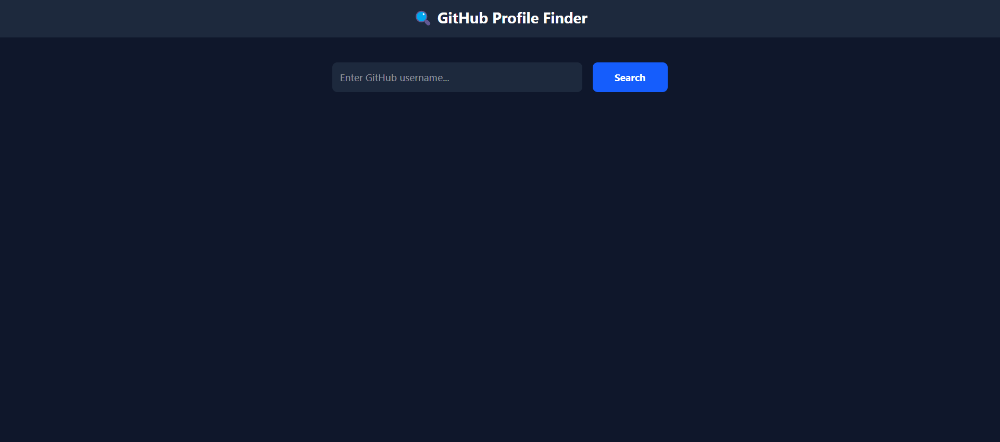
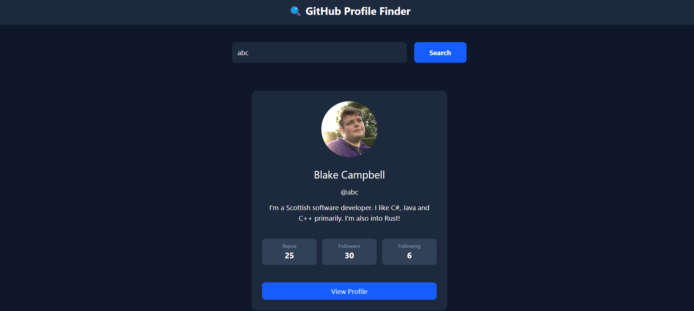

# 🔍 React GitHub Profile Finder


A responsive React application that allows users to search GitHub profiles and view real-time user information using the GitHub API.

---

## 📸 Project Previews

### 1. The Search Interface


### 2. Live Data Rendering



---

## ✨ Key Features & Logic

- **⚡ Real-time API Integration:** Fetches live user data directly from the official GitHub REST API using modern `async/await` Promises.
- **🛡️ Robust Error Handling:** Intelligently catches invalid usernames and renders a custom "User Not Found" state instead of crashing.
- **⏳ Dynamic Loading States:** Provides visual feedback to the user while data is being fetched over the network.
- **🎨 Modern UI/UX:** Designed with a sleek Dark Mode aesthetic using Tailwind CSS, featuring hover transitions, focus rings, and custom stat badges.
- **🧹 Clean State Management:** Efficiently utilizes React's `useState` hook to separate UI states (Loading, Error, and Data).

---

## 🛠️ Technologies Used

- **Frontend Library:** React.js (Functional Components & Hooks)
- **Styling:** Tailwind CSS
- **Data Fetching:** Native JavaScript Fetch API
- **Version Control:** Git & GitHub

---

## 💻 How to Run Locally

Follow these steps to run the project locally:

```bash
# 1. Clone the repository
git clone https://github.com/Ayesha-Saddique9/react-github-profile-finder.git

# 2. Navigate into the project folder
cd react-github-profile-finder

# 3. Install dependencies
npm install

# 4. Start the development server
npm run dev
```

---
## 📚 What I Learned

- Working with React Hooks (`useState`, `useEffect`)
- Fetching data from external APIs
- Managing loading and error states
- Building responsive interfaces with Tailwind CSS
- Handling user input and dynamic rendering

  
---
## 👩‍💻 Author

**Ayesha Saddique**  
Frontend Web Developer

🔗 GitHub: https://github.com/Ayesha-Saddique9

💼 LinkedIn: https://linkedin.com/in/ayesha-saddique9

📧 Email: ayeshasaddique70@gmail.com

⭐ If you found this project useful, consider giving it a star!
